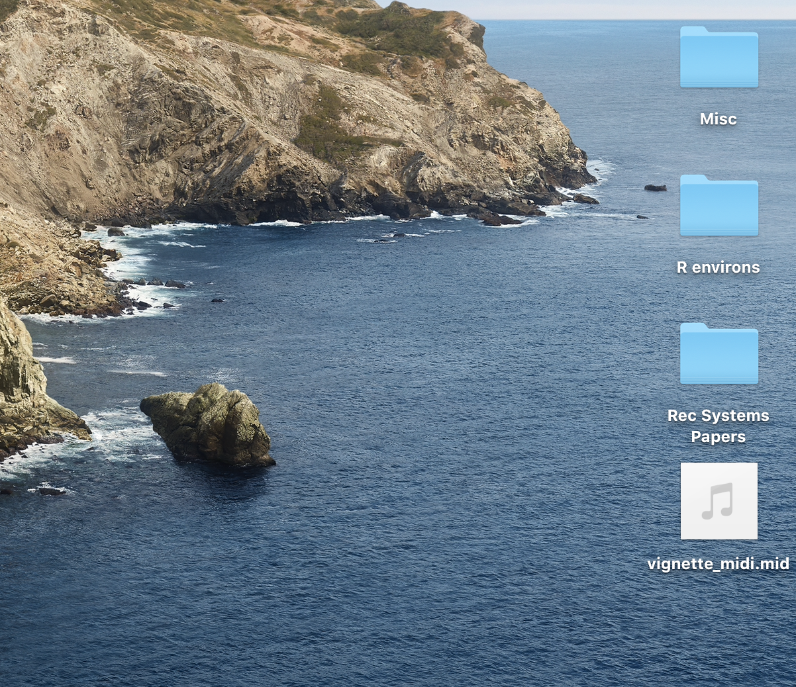
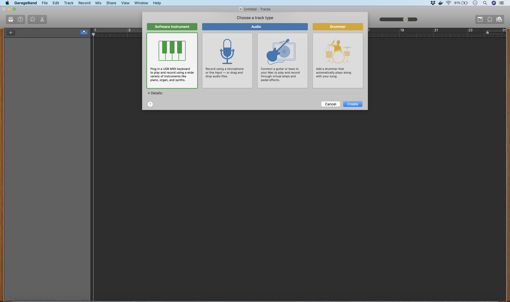
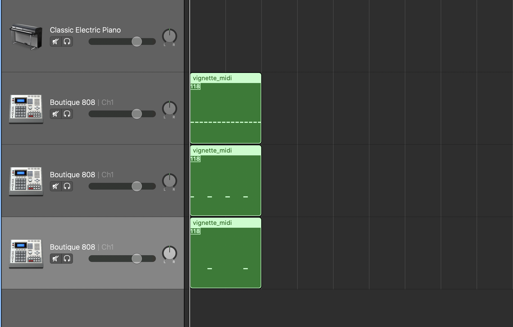

```{r, include = FALSE}
knitr::opts_chunk$set(
  collapse = TRUE,
  comment = "#>"
)
```

```{r setup, echo = FALSE, warning = 'hide', message=FALSE}
library(midiR)
library(dplyr)
library(lattice)
```

The midiR package was created to allow R users to make music in R.  Specifically, this package provides a set of functions that aid in the creation of MIDI files.  MIDI files are musical compositions that can be read by a computer. Digital synthesizers can read MIDI files like sheet music and produce music from them.       

You don't need your own synthesizer to play MIDI files.  Your computer likely comes with a program that has synthesizers that can play MIDI files.  If you're a Mac user, Mac computers come with Garage Band, a digital audio workstation that comes with several digital synthesizers that can play MIDI files.  For PC users, Audacity is a free, open-source digital audio workstation that you can download online. 

## Drum Machine 

The current version of midiR comes with one main function for generating music, drum_machine.  This function emulates a 16-step drum sequencer.  Three drum arguments, hh (for hi-hat), kick, and snare, take as their arguments numeric vectors containing numbers from 1 to 16.  The function returns a named list, displaying the notes associated with each parameter.  Let's go through a simple example and examine its output.

```{r}
drum_machine(hh = 1:16, kick = seq(1, 16, by = 4), snare = c(5, 13))
```

This represents the first drum beat many drummers learn.  The hi-hihat parameter is given 1:16, which is a numeric vector with every integer from 1 to 16.  This means that the hi-hat has a hit on every step of the 16-step sequence.  The kick has the argument seq(1, 16, by = 4).  This is a numeric vector that counts from 1 to 16 by 4, so the kick will sound on the 1, 5, 9, and 13 of the 16-step sequence.  Finally, the snare will sound on the 5 and 13.  Take a moment to examine the list that this function returns.  The elements of this list are named with the parameter names of the drum_machine function.  For each element, we have a length-16 character vector.  In positions with hits, the appropriate note is written in this vector.  In positions without hits,  we have the word "rest".  These vectors also have special attributes.  I will explain what these are later on.

The drum_machine function takes 16-step drum sequences and converts them into a human-readable format.  How do we convert these into a format that a computer can read?  To do this, I use the next important function of midiR, create_midi.

## Create MIDI and Write MIDI

MIDI files contain a stream of binary data organized into 8-bit bytes (e.g. 00000001).  Computer programmers generally produce this information in hexadecimal (base-16) format because this is easier to read and write.  For instance, the number 210 takes fewer characters to write in hex (D2) than it does in binary (11010010).  The details of the MIDI format are beyond the scope of this tutorial.  For readers wanting to learn more about the MIDI language, I recommended this page - https://www.mobilefish.com/tutorials/midi/midi_quickguide_specification.html - for a useful example of a MIDI sequence and what each component in this sequence represents.  

For the purposes of this vignette, you only need to know that the create_midi function takes a musical sequence like the one created in the previous section and converts it to hex.  Let's see what this looks like.  

```{r}
drum_machine(hh = 1:16, kick = seq(1, 16, by = 4), snare = c(5, 13)) %>% 
  create_midi()
```

Here's the drum sequence we made in the previous section in machine-readable, hexadecimal format.  Now we can save this as a .mid file with the write_midi function.  This function takes two arguments, the MIDI object itself (the hexadecimal code returned from the lines of code above) and a name for the file.  For this example, I save the file as "vignette_midi.mid".

```{r}
drum_machine(hh = 1:16, kick = seq(1, 16, by = 4), snare = c(5, 13)) %>% 
  create_midi() %>% 
  write_midi(., "vignette_midi.mid")
```

This saved a MIDI file called "vignette_midi.mid" to my working directory, which in my case is my Desktop.  The image below shows that MIDI file that I just saved.     

```{r echo=FALSE, out.width='60%'}

```

Now that we have the MIDI file on our computer, what can we do with it?  Seeing as many of the readers are likely working on Macs, I'll explain how to import this file into Garage Band.  First open the Garage Band application.  If you don't get Garage Band installed, you can get it for free from the Apple store.  

```{r echo=FALSE, out.width='60%'}

```

Here's what the opening screen looks like when you start Garage Band.  Click the keyboard icon under "Choose a track type" to start a session with an instrument track.  Next, simply drag the .mid file to an empty space on the project screen (not the "Classic Electric Piano track"!) to import the MIDI file.  You will see a message asking if you want to follow the tempo information in the MIDI file.  Click "No".  The default tempo in Garage Band and all other digital audio workstations is 120 beats per minute.  The MIDI should be imported into Garage Band and look like this - 

```{r echo=FALSE, out.width='60%'}

```

A few things to note.  First, we've actually created three MIDI files, one for each drum part (hi-hat, kick, and snare) in the sequence. Storing the parts on separate tracks allows midiR to do things that it wouldn't be able to do otherwise, such as route control changes to different tracks in the sequence (more on this later).  Second, you might notice that the instrument on each of these tracks is called Boutique-808.  This is an emulation of the famous Roland 808 Drum Machine, and it comes free with Garage Band.  How did Garage Band know that this MIDI was intended for drums?  Recall that the elements of the list created by drum_machine had attributes.  One of these, "meta", stores instrument information.  The instrument "C0 07 76" corresponds with a drumset on many digital synthesizers and digital audio workstations.  Go ahead and press your space bar to listen to this sequence.  Here's a sample of what it will sound like.


Voila!  We have composed a drum sequence in R.  Next, let's create something a little more interesting with the random_modify function.

## Going Deeper with Random Modify 

The random_modify function can take very simple drum sequences and make them more interesting.  The function takes the sequence as its first argument and a modifier as its second argument.  There are three modifiers I will talk about here: double, roll, and flam.  Each of these modifies a drum hit in a different way.  For example, the double modifier takes an eighth-note hit and converts it to two consecutive sixteenth-note hits.  The roll modifier takes an eighth-note hit and turns it into three consecutive 24th-note hits.  Finally, the flam modifier takes an eighth-note hit and returns two eighth notes played almost (but not quite) at the same time.  

To make this more concrete, here's an example.

```{r, eval = FALSE}
drum_machine(hh = 1:16, kick = seq(1, 16, by = 4), snare = c(5, 13)) %>% 
  random_modify(., modifier = "double", track_apply = 1)
```

In the example above, I start with the same drum sequence we created previously.  I use the pipe operator to feed this sequence into the first 
argument of the random_modify function and set the modifier parameter to "double".  Finally, the track_apply parameter allows me to specify the track (hi-hat, kick, or snare) I want to apply the modification to.  By default the function applies the modification to all the tracks.  Enter a number corresponding to the order of the arguments in the drum_machine function.  Here I enter "1" because the hi-hat is the first argument of the drum_machine function and I only want to apply this modification to the hi-hat.  Let's here what this sounds like.


This is the same as the last drum sequence except that now the hi-hat is playing sixteenth notes instead of eighth notes.  Note that the kick and the snare are exactly the same.  

We might want to apply modifications randomly across the sequence.  This can be done with the prob parameters.

```{r, eval = FALSE}
set.seed(123)

drum_machine(hh = 1:16, kick = seq(1, 16, by = 4), snare = c(5, 13)) %>% 
  random_modify(., modifier = "double", prob = .5, track_apply = 1)
```

This is the same as the last sequence, except that now the prob parameter specifies that the double modification will be applied to the hits with a 50% probability.  Let's hear how this sounds.  The set.seed(123) line of code ensures that we're hearing the same thing.  


It's amazing how much life a little randomness can give to a drum loop.  

Let's experiment with this function a little more.  In the code below, I use the rep argument of the drum_machine function to repeat the drum sequence 4 times.  I then pass this into a few random_modify functions that apply different modifications randomly across the sequence.

```{r, eval = FALSE}
drum_machine(hh = 1:16, kick = seq(1, 16, by = 4), snare = c(5, 13), rep = 4) %>% 
  random_modify(., modifier = "double", prob = .5, track_apply = 1) %>% 
  random_modify(., modifier = "roll", prob = .2, track_apply = 1) %>% 
  random_modify(., modifier = "double", prob = .3, track_apply = 2) %>% 
  random_modify(., modifier = "flam", prob = .2, track_apply = 1)
```


This is nice, but perhaps you'd like a little more control over which parts of the drum track the random modifier applies modifications to.  This can be accomplished with the position parameter.  The position parameter takes as its argument a special function called the template function.  The first one or more arguments of the template function are positions you'd like to apply the modification to.  The last argument, which is required and has to be named, is the "every" argument.  This specifies how many notes in the sequence the modification should apply to before being repeated.  For example, "template(1, 3, every  = 4)" means apply the modification to the first and third notes for every 4 notes in a sequence.  In the sequence has 16 notes, the modification will be applied to notes 1, 3, 5, 7, 9, 11, 13, and 15.  The position argument takes a bit of practice getting used to, but once you've figured it out it gives you almost complete control over applying modifications to a drum sequence.

Let's go through another example.  Let's say we want the hi-hat to play sixteenth-notes (the double modification) on every even-numbered hit except for the eighth hit, on which we want it to play a triplet (roll).  Here's how we'd do this.

```{r, eval = FALSE}
drum_machine(hh = 1:16, kick = seq(1, 16, by = 4), snare = c(5, 13), rep = 4) %>% 
  random_modify(., modifier = "double", position = template(2,4,6, every = 8), track_apply = 1) %>% 
  random_modify(., modifier = "roll", position = template(8, every = 8), track_apply = 1)
```

Pretty simple.  Now let's give the sequence a double kick on the first note of every 16 notes.

```{r, eval = FALSE}
drum_machine(hh = 1:16, kick = seq(1, 16, by = 4), snare = c(5, 13), rep = 4) %>% 
  random_modify(., modifier = "double", position = template(2,4,6, every = 8), track_apply = 1) %>% 
  random_modify(., modifier = "roll", position = template(8, every = 8), track_apply = 1) %>% 
  random_modify(., modifier = "double", position = template(1, every = 16), track_apply = 2)
```

Note that the track_apply parameter for this last line of code has a 2 because the kick is the second parameter of the drum_machine function.  Finally, let's add a flam to the snare.  This should come every 4th time the snare plays.  Because the snare is in the 5 and 13 positions of the original sequence, the fourth snare hit will be the 29th position in a 32-step sequence (13 + 16 = 29).

```{r, eval = FALSE}
drum_machine(hh = 1:16, kick = seq(1, 16, by = 4), snare = c(5, 13), rep = 4) %>% 
  random_modify(., modifier = "double", position = template(2,4,6, every = 8), track_apply = 1) %>% 
  random_modify(., modifier = "roll", position = template(8, every = 8), track_apply = 1) %>% 
  random_modify(., modifier = "double", position = template(1, every = 16), track_apply = 2) %>% 
  random_modify(., modifier = "flam", position = template(29, every = 32), track_apply = 3) 
```

Let's hear how this sounds.


This is fine, but I miss the randomness of the last drum loop.  Let's conclude by incorporating some randomness into this sequence with the prob parameter.  

```{r, eval = FALSE}
drum_machine(hh = 1:16, kick = seq(1, 16, by = 4), snare = c(5, 13), rep = 8) %>% 
  random_modify(., modifier = "double", position = template(2,4,6, every = 8), prob = .7, track_apply = 1) %>% 
  random_modify(., modifier = "roll", position = template(8, every = 8), prob = .7, track_apply = 1) %>% 
  random_modify(., modifier = "double", position = template(1, every = 16), prob = .7, track_apply = 2) %>% 
  random_modify(., modifier = "flam", position = template(29, every = 32), prob = .7, track_apply = 3) %>% 
  random_muter(., prob = .1, track_apply = 1) %>% 
  drum_shifter(., shift = 'D#2', prob = .1, track_apply = 1) %>% 
  drum_shifter(., shift = 'G#1', prob = .2, track_apply = 1)
```

I give a probability of .5 to the double modification for the hi-hat and a probability of .7 to all the other modifications.  I also increase the rep argument in drum_machine to 8 to really let the sequence breathe.  I also route this to a new function that I haven't mentioned yet: random_muter.  This works like the random_modify function but it doesn't have a modifier parameter.  It randomly mutes hits in a sequence.  By setting the prob parameter to .1, I specify that every hit will be muted with a probability of .1.  I apply this only to the hi-hat.  Finally, I use another new function, drum_shifter.  This takes a hit an shifts it to a note specified.  I happen to know that D#2 and G#1 are other hi-hat sounds on the 808 set in Garage Band, so I random shift the hi-hat (track_apply = 1) so these alternate hits with probabilities .1 and .2.  Here's the result.


That's all I have for now.  Check out the midiR (https://github.com/datadiarist/midiR) repository on Github for updates.  I have ambitious plans for this package, including new MIDI generators (e.g. a bass synthesizer, a melody generator), new randomization features, and a feature that let's you compose more complex MIDI sequences using nested Markov chains.  


